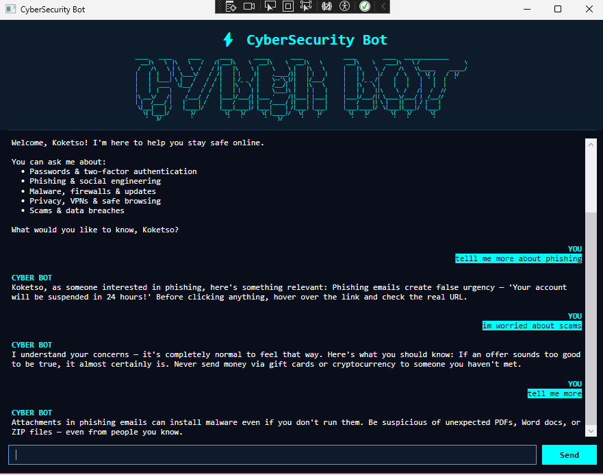
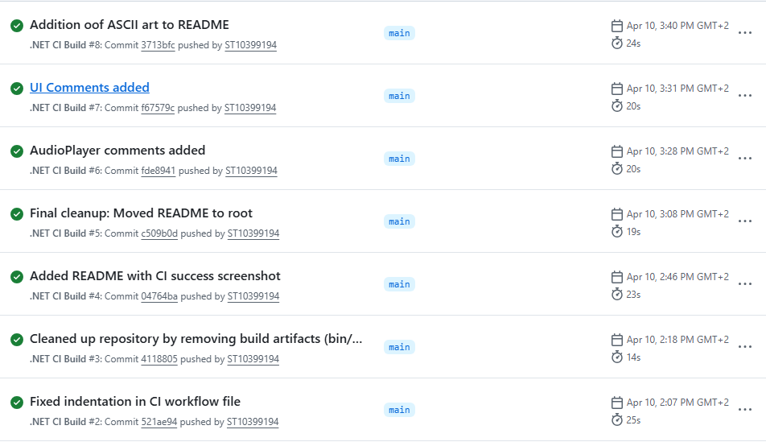

# Cybersecurity Chatbot App
An interactive C# WPF desktop assistant that identifies security topics, tracks user sentiment, and maintains session memory.

## Student Information
* **Name:** Koketso Modiselle
* **Student Number:** ST10399194
* **Coursework:** PROG6221 POE (Part 2)

---

## Features Implemented (Part 2)

### Core Backend Architecture
* **Orchestrator Engine (`ChatBot.cs`):** Manages the core startup logic. It prints custom ASCII branding art and executes the initialization greeting.
* **Topic Router (`KeywordResponder.cs`):** Uses an optimized data dictionary. It covers 5 distinct cybersecurity categories and picks random response variations.
* **Emotion Analysis (`SentimentDetector.cs`):** Evaluates user text patterns. It gauges user emotions and dynamically alters response tones.
* **Session Tracking (`MemoryStore.cs`):** Saves user data state locally. It logs user names and favorite topics for contextual call-backs.

### Modern Frontend User Interface
* **WPF Interface Layout:** Built with native XAML files. Features an organized header pane, a central conversation logs area, and user input fields.
* **Async Typing Animation:** Uses non-blocking thread scheduling (`Task.Delay`). Delivers text characters sequentially to mimic human chat habits.
* **Custom Chat Bubbles:** Styled text initialization fields. Highlights bot output  in Cyan and user blocks  in bold.
* **Viewport Synchronization:** Automated view scroll management. Forces the RichTextBox text canvas view to lock down instantly on new entries.

---

## Prerequisites
* **Operating System:** Windows 10 / Windows 11
* **Development Environment:** Visual Studio 2022
* **Target Framework Runtime:** .NET 8.0 SDK

---

## Step 1.3 - Link Your Part 1 WAV File
The application assets track the voice greeting system using automatic compilation routing flags:
1. Copy your asset file named `greeting.wav` from your storage drive.
2. In **Solution Explorer**, right-click the root project and click **Paste**.
3. Right-click the newly pasted `greeting.wav` file and select **Properties**.
4. Change the configuration item **Copy to Output Directory** to **Copy always**.

---

## Step-by-Step Deployment Instructions

### 1. Clone the Repository
Open a command prompt window and run the terminal cloning command:
```bash
git clone https://github.com
```

### 2. Launch Solution File
1. Open your **Visual Studio 2022** launcher.
2. Choose the option labeled **Open a project or solution**.
3. Browse inside the repository path and launch the `CybersecurityChatbot.sln` file.

### 3. Build & Run Application
1. Confirm the solution configuration target drop-down is set to **Debug**.
2. Press the **F5** hotkey or click the green **Start** arrow on the top menu bar.

---

## Project Deliverables

### Running GUI Screenshot



### GitHub Actions Build Status


### YouTube Demonstration Link
* Unlisted Walkthrough Video: https://youtu.be/4NQJ9tslc9Q 